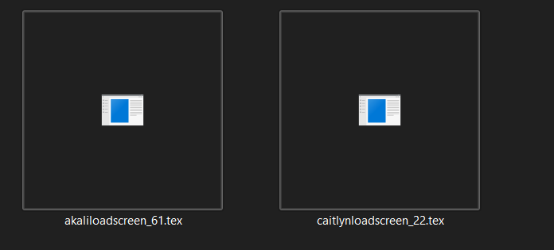
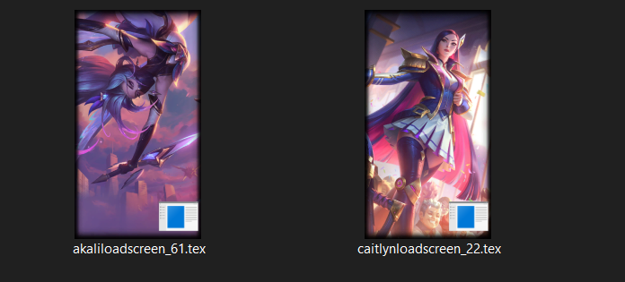

# TexThumbnailProvider

Windows Explorer thumbnail provider for `.tex` files.

This project builds a COM in-process DLL that registers an `IThumbnailProvider` handler for the `.tex` extension, then decodes supported texture formats into ARGB bitmaps for Explorer thumbnails.

## Preview

<p align="center">
	
</p>

<p align="center">
	
</p>

## Features

- Shell thumbnail handler for `.tex` files.
- Explorer integration via COM registration under `HKCU` (current user).
- Decoding support currently implemented for:
	- `bgra8`
	- `dxt1`
	- `dxt5`

## Requirements

- Windows 10/11
- Visual Studio 2022 (or Build Tools) with C++ workload
- CMake 3.20+

## Build

```powershell
cmake -S . -B build -G "Visual Studio 17 2022" -A x64
cmake --build build --config Release
```

Build output (default):

- `build/Release/TexThumbnailProvider.dll`

## Install (Register the COM Server)

Run from an elevated (admin) PowerShell or Command Prompt in the repository root:

```powershell
regsvr32 build\Release\TexThumbnailProvider.dll
```

After registration, restart Explorer if thumbnails do not refresh immediately.

## Uninstall (Unregister)

```powershell
regsvr32 /u build\Release\TexThumbnailProvider.dll
```

## Notes

- Registration is written under `HKEY_CURRENT_USER\Software\Classes`, so it is user-scoped.
- The handler CLSID is `{243B3EEC-8FD0-44CD-95AD-BEAFDCE52CBF}`.
- The implementation links against `shlwapi` and `windowscodecs`.

## Troubleshooting

- No thumbnails after registering:
	- Confirm the DLL exists at `build/Release/TexThumbnailProvider.dll`.
	- Re-run registration command and ensure it succeeds.
	- Use the Disk Cleanup for clearing thumbnail cache and restart Explorer .

## Credits

- Benjamin Dobell [s3tc-dxt-decompression](https://github.com/Benjamin-Dobell/s3tc-dxt-decompression)
- Moritz Bender [Ritoddstex](https://github.com/Morilli/Ritoddstex)
- Microsoft [RecipeThumbnailProvider](https://github.com/microsoft/Windows-classic-samples/tree/main/Samples/Win7Samples/winui/shell/appshellintegration/RecipeThumbnailProvider)

## License

See `LICENSE.txt`.

